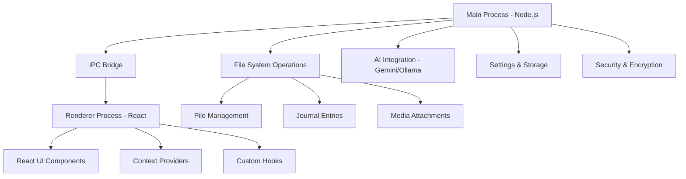
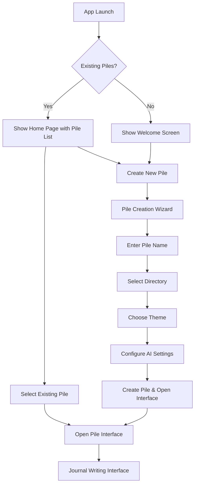
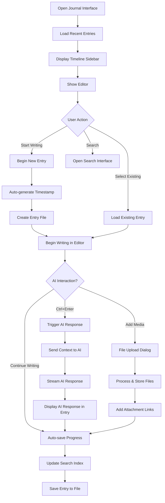
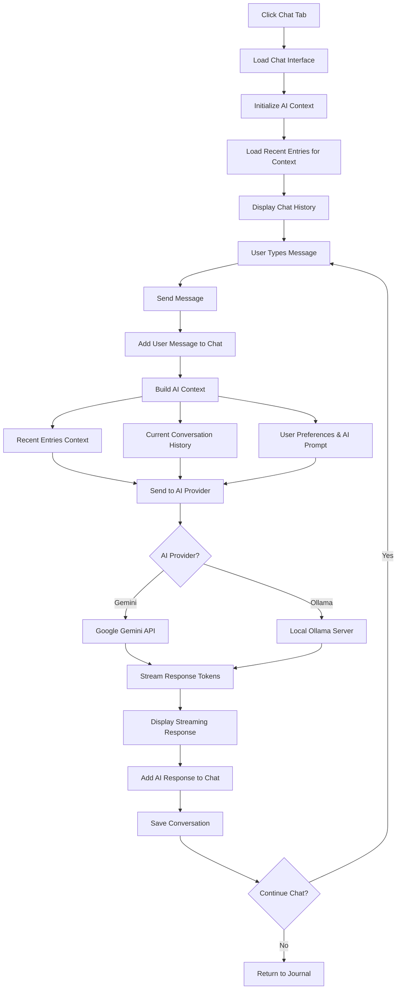
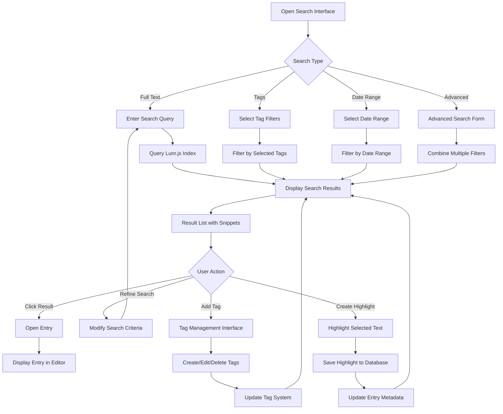
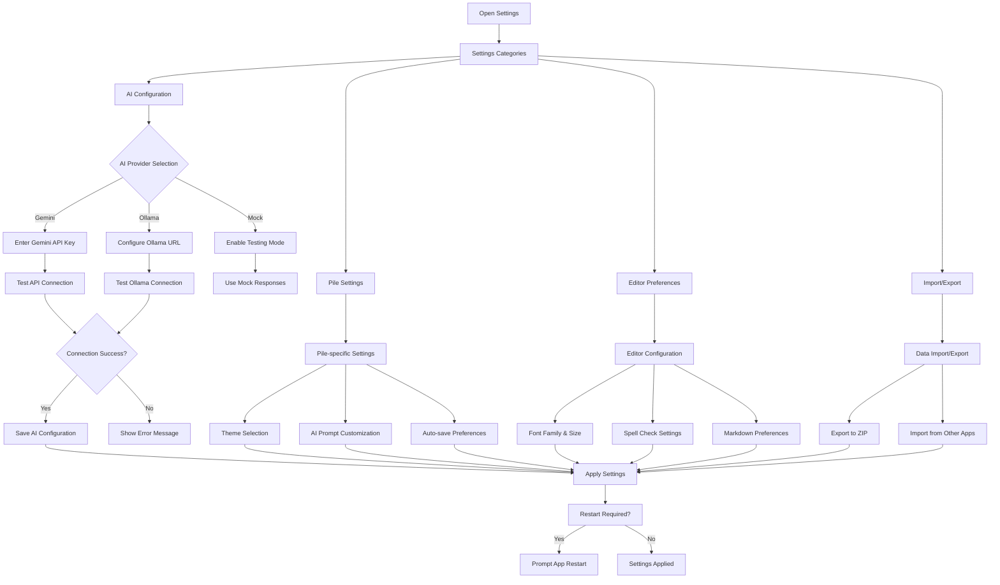

# PileBintang - Comprehensive Project Description

## Project Overview

**PileBintang** is a sophisticated cross-platform desktop journaling application with integrated AI assistance, built using modern web technologies and Electron. This document provides a detailed technical specification for recreating this application in different technologies.

### Version Information
- **Current Version**: 1.0.0
- **License**: MIT
- **Original Repository**: https://github.com/UdaraJay/Pile (forked to ChaostixZix/PileBintang)
- **Author**: Udara Jay (me@udara.io)

## Technology Stack

### Core Technologies
- **Application Framework**: Electron 33.2.0 (Cross-platform desktop app)
- **Frontend Library**: React 19.0.0 with React DOM
- **Type System**: TypeScript 5.2.2
- **Build System**: Webpack 5.88.2 with custom ERB (Electron React Boilerplate) configuration
- **Styling**: SCSS with CSS Modules
- **State Management**: React Context API (no Redux)

### UI & UX Libraries
- **Rich Text Editor**: TipTap 2.10.2 (ProseMirror-based)
  - Extensions: Character Count, Link, Placeholder, Typography
  - Markdown serialization and deserialization
- **Animations**: Framer Motion 11.2.4 (smooth page transitions and UI interactions)
- **UI Components**: Radix UI primitives
  - Alert Dialog, Dialog, Dropdown Menu, Switch, Tabs
- **Virtualization**: 
  - @tanstack/react-virtual 3.0.1 (for large lists)
  - react-virtuoso 4.12.1 (timeline and posts)
- **Routing**: React Router DOM 6.23.1

### AI Integration
- **Primary AI Provider**: Google Gemini 2.5 Pro (@google/generative-ai 0.24.1)
  - Streaming text generation
  - JSON mode for structured responses
  - Context-aware conversations
- **Local AI Provider**: Ollama integration (for privacy-focused users)
- **HTTP Client**: Axios 1.6.8 (for API requests)

### Data & File Management
- **Markdown Processing**: gray-matter 4.0.3 (frontmatter + content)
- **File Operations**: Node.js fs with glob 11.0.0 pattern matching
- **Search**: Lunr.js 2.3.9 (full-text search indexing)
- **Date/Time**: Luxon 3.3.0 (DateTime manipulation)
- **Settings Storage**: electron-settings 4.0.4 (persistent app configuration)

### Development Tools
- **Linting**: ESLint 8.49.0 with Airbnb config
- **Testing**: Jest 29.7.0 with Testing Library
- **Hot Reload**: React Refresh + Webpack Dev Server
- **Package Builder**: electron-builder 24.13.3
- **Process Monitor**: electronmon 2.0.2 (development file watching)

## Application Architecture

### Electron Multi-Process Architecture



### Security Model
- **Context Isolation**: Enabled - Renderer process isolated from Node.js APIs
- **Node Integration**: Disabled in renderer process
- **Preload Script**: Secure contextBridge APIs for IPC communication
- **Content Security Policy**: Strict CSP headers
- **API Key Storage**: Encrypted using electron-settings
- **File Access**: Limited to user-selected directories

### File Structure Organization

```
Pile Directory/
├── piles.json                 # Pile configuration and metadata
├── YYYY/                      # Year-based organization
│   ├── MMM/                   # Month abbreviation (Jan, Feb, etc.)
│   │   ├── YYMMDD-HHMMSS.md   # Journal entries with timestamp
│   │   ├── media/             # File attachments for entries
│   │   │   ├── images/
│   │   │   ├── documents/
│   │   │   └── audio/
│   │   └── metadata.json      # Month metadata (optional)
│   └── ...
├── tags.json                  # Tag definitions and relationships
├── highlights.json            # Saved highlights across entries
├── links.json                 # Internal and external links
└── search-index.json          # Cached search index
```

### Journal Entry Format (Markdown + Frontmatter)

```markdown
---
title: "Daily Reflection"
date: "2024-01-15T14:30:00Z"
tags: ["reflection", "goals", "work"]
mood: "positive"
weather: "sunny"
location: "home"
attachments: ["media/images/photo1.jpg"]
ai_summary: "User reflected on daily accomplishments and set goals for tomorrow"
---

# Today's Thoughts

Your journal content goes here in **markdown** format.

## Goals for Tomorrow
- [ ] Complete project documentation
- [ ] Review code changes
- [ ] Plan team meeting

The AI can respond to your thoughts here, providing insights and encouragement.
```

## Core Features & Components

### 1. Pile Management System

**Purpose**: Organize journals into separate workspaces ("piles") for different life areas, projects, or time periods.

**Key Components**:
- **Pile Creation Wizard** (`src/renderer/pages/CreatePile/`)
  - Name input and validation
  - Directory selection dialog
  - Theme selection
  - Initial configuration setup
- **Pile Selection Interface** (`src/renderer/pages/Home/`)
  - Grid/list view of available piles
  - Recent activity indicators
  - Quick actions (open, delete, settings)
- **Pile Context Provider** (`src/renderer/context/PilesContext.js`)
  - Current pile state management
  - Pile creation, deletion, updating
  - Theme and preference synchronization

**Technical Implementation**:
```javascript
// Pile structure in piles.json
{
  "piles": [
    {
      "id": "uuid-v4",
      "name": "Personal Journal",
      "path": "/Users/username/Documents/Personal",
      "theme": "default",
      "created": "2024-01-01T00:00:00Z",
      "lastAccessed": "2024-01-15T14:30:00Z",
      "aiProvider": "gemini",
      "aiPrompt": "Custom AI personality...",
      "settings": {
        "autoSave": true,
        "spellCheck": true,
        "wordWrap": true
      }
    }
  ]
}
```

### 2. Rich Text Editor System

**Purpose**: Provide a modern, extensible writing experience with markdown support and real-time AI integration.

**Key Components**:
- **TipTap Editor** (`src/renderer/pages/Pile/Editor/`)
  - ProseMirror-based rich text editing
  - Markdown serialization/deserialization
  - Custom extensions for journaling workflow
- **AI Integration** - Inline AI assistance during writing
- **File Attachments** - Drag & drop media integration
- **Auto-save** - Continuous saving to prevent data loss

**Editor Extensions & Features**:
```javascript
// TipTap extensions used
const extensions = [
  StarterKit,              // Basic rich text features
  Typography,              // Smart quotes, em dashes
  Link,                    // URL link handling
  Placeholder,             // Placeholder text
  CharacterCount,          // Word/character counting
  CustomSubmit,            // AI trigger on Cmd/Ctrl+Enter
  DragDrop,               // File upload handling
  AutoSave,               // Continuous saving
]
```

**File Upload & Media Management**:
- Drag & drop file uploads
- Automatic file organization by type (images, documents, audio)
- Thumbnail generation for images
- File size limits and validation
- Attachment metadata in frontmatter

### 3. AI Integration System

**Purpose**: Provide intelligent writing assistance, reflection prompts, and conversational journaling support.

**Supported AI Providers**:

#### Google Gemini 2.5 Pro Integration
- **Model**: `gemini-2.5-flash` (default) or `gemini-2.5-pro`
- **Features**:
  - Streaming text generation (token-by-token)
  - JSON mode for structured responses
  - Context-aware conversations
  - Large context window (up to 1M tokens)
- **API Integration**: `@google/generative-ai` SDK
- **Security**: API keys encrypted in electron-settings

#### Ollama (Local AI) Integration
- **Purpose**: Privacy-focused local AI processing
- **Supported Models**: Any Ollama-compatible model (Llama 2, Code Llama, etc.)
- **Connection**: HTTP API to local Ollama server
- **Advantages**: No data leaves device, no API costs, offline capability

**AI Context System**:
```javascript
// AI context building for conversations
const aiContext = {
  systemPrompt: "Custom AI personality for this pile",
  recentEntries: "Last 10 journal entries for context",
  currentEntry: "Current journal content being written",
  userPreferences: "Writing style, tone preferences",
  conversationHistory: "Previous AI interactions"
}
```

**AI Features**:
- **Inline Suggestions**: AI responds to journal entries in real-time
- **Conversation Mode**: Dedicated chat interface for reflection
- **Summaries**: AI-generated entry summaries and insights
- **Mood Analysis**: Sentiment analysis and mood tracking
- **Writing Prompts**: AI-suggested topics and questions

### 4. Search & Organization System

**Purpose**: Help users find, categorize, and navigate their journal entries effectively.

**Search Implementation**:
- **Full-Text Search**: Lunr.js indexing of all journal content
- **Tag-based Filtering**: Hierarchical tag system with autocomplete
- **Date Range Filtering**: Calendar-based date selection
- **Content Type Filtering**: Text, images, attachments, AI responses
- **Advanced Search**: Boolean operators, phrase matching, field-specific search

**Tagging System**:
```javascript
// Tag structure in tags.json
{
  "tags": [
    {
      "id": "work",
      "name": "Work",
      "color": "#3B82F6",
      "parent": null,
      "children": ["meetings", "projects", "goals"],
      "count": 45,
      "created": "2024-01-01T00:00:00Z"
    }
  ]
}
```

**Timeline Navigation**:
- **Chronological View**: Time-based entry browsing
- **Calendar Integration**: Month/week/day views
- **Activity Heatmaps**: Writing activity visualization
- **Streak Tracking**: Daily writing habit tracking

### 5. Highlights & Links System

**Purpose**: Preserve important insights and create connections between journal entries.

**Highlights System**:
- **Text Selection**: Click and drag to highlight important passages
- **Color Coding**: Different highlight colors for categorization
- **Cross-Entry Highlights**: View all highlights across journal entries
- **Export Capabilities**: Export highlights as markdown or PDF

**Links System**:
- **Internal Links**: Link between journal entries using `[[entry-title]]` syntax
- **External Links**: Web URLs with automatic preview generation
- **Backlinks**: Show which entries link to current entry
- **Link Graph**: Visual representation of entry connections

## User Flow Diagrams

### 1. Application Launch & Pile Selection



### 2. Journal Writing & AI Interaction Flow



### 3. AI Chat & Conversation Flow



### 4. Search & Organization Flow



### 5. Settings & Configuration Flow



## Technical Implementation Details

### IPC (Inter-Process Communication) Architecture

**Preload Script** (`src/main/preload.ts`):
```typescript
// Secure API exposure to renderer
contextBridge.exposeInMainWorld('electron', {
  ipc: {
    sendMessage: (channel: string, ...args: any[]) => 
      ipcRenderer.send(channel, ...args),
    invoke: (channel: string, ...args: any[]) => 
      ipcRenderer.invoke(channel, ...args),
    on: (channel: string, callback: (...args: any[]) => void) =>
      ipcRenderer.on(channel, (_, ...args) => callback(...args)),
    removeAllListeners: (channel: string) =>
      ipcRenderer.removeAllListeners(channel)
  }
})
```

**IPC Handlers** (`src/main/handlers/`):
- **file.ts**: File operations, pile management, entry CRUD
- **gemini.ts**: AI integration, streaming responses
- **keys.ts**: Encrypted API key storage and retrieval
- **store.ts**: Application settings and preferences
- **tags.ts**: Tag management and relationships
- **highlights.ts**: Highlight storage and retrieval
- **links.ts**: Link processing and backlink generation

### State Management (React Context)

**Context Providers**:
1. **PilesContext**: Current pile, pile list, pile operations
2. **AIContext**: AI provider, API keys, generation functions
3. **IndexContext**: Search index, full-text search capabilities
4. **TagsContext**: Tag list, tag operations, filtering
5. **TimelineContext**: Entry timeline, date navigation
6. **HighlightsContext**: Highlight management across entries
7. **LinksContext**: Internal/external link management
8. **ToastsContext**: Notification system for user feedback

### Custom Hooks

**Key Hooks** (`src/renderer/hooks/`):
- **useElectronStore**: Interface with electron-settings
- **useChat**: AI conversation management
- **useGeminiStream**: Streaming AI responses
- **useSearch**: Full-text search functionality
- **useTimeline**: Timeline navigation and date filtering
- **useFileUpload**: Drag & drop file handling

### Build & Development Configuration

**Development Workflow**:
```bash
# Development commands
npm install --legacy-peer-deps    # Install dependencies
npm start                        # Start dev server with hot reload
npm run start:main               # Start main process with watching
npm run start:renderer           # Start renderer dev server

# Build commands
npm run build                    # Production build (main + renderer)
npm run package                  # Create distributable packages
npm run release                  # Build and publish to GitHub

# Code quality
npm run lint                     # ESLint code analysis
npm run lint:fix                 # Auto-fix linting issues
npm test                         # Run Jest test suite
```

**Webpack Configuration**:
- **Main Process**: TypeScript compilation, Node.js target
- **Renderer Process**: React, SCSS, CSS Modules, hot reload
- **Preload Script**: Secure IPC bridge compilation
- **Development DLL**: Faster rebuilds for development dependencies

**Electron Builder Configuration**:
- **macOS**: Universal binary (ARM64 + x64), notarization, DMG packaging
- **Windows**: NSIS installer, both x64 and ia32 architectures
- **Linux**: AppImage format for broad compatibility
- **Auto-updater**: GitHub releases integration for automatic updates

## Platform-Specific Features

### macOS
- **Traffic Light Positioning**: Custom titlebar with native window controls
- **Vibrancy Effects**: Transparent window backgrounds with system blur
- **Dock Integration**: Badge counts, progress indicators
- **Menu Bar Integration**: Native menu structure
- **Notification Center**: System notifications for AI responses

### Windows
- **Custom Frame**: Consistent UI across Windows versions
- **Taskbar Integration**: Progress indicators, jump lists
- **Windows Store Compatibility**: Prepared for store distribution
- **File Association**: Register for .md and custom file types

### Linux
- **AppImage Distribution**: Single-file executable for all distros
- **Desktop Integration**: .desktop file creation, icon installation
- **File Manager Integration**: Context menu actions for journal files
- **Wayland Compatibility**: Support for modern Linux desktop environments

## Migration Considerations

### For Web-Based Implementation
- **Replace Electron**: Use Progressive Web App (PWA) with File System Access API
- **File Storage**: IndexedDB or Origin Private File System API
- **AI Integration**: Direct API calls with CORS proxy for Gemini
- **Security**: Web-based encryption for API keys using Web Crypto API

### For Native Mobile (React Native/Flutter)
- **File System**: Platform-specific file management APIs
- **Rich Text Editor**: Platform-appropriate rich text components
- **AI Integration**: HTTP API calls with platform-specific networking
- **Synchronization**: Add cloud sync capabilities for mobile use

### For Desktop (Tauri/Qt/GTK)
- **Rust Backend**: Tauri with Rust for system integration
- **Native UI**: Platform-specific UI frameworks instead of web technologies
- **Performance**: Potentially better performance with native compilation
- **Bundle Size**: Smaller distribution packages compared to Electron

### For Server-Based Implementation
- **Backend**: Node.js/Python/Go API server with database storage
- **Frontend**: React SPA or server-rendered pages
- **Multi-user**: Add user authentication and isolation
- **Real-time**: WebSocket connections for real-time AI streaming

## Dependencies & Licensing

### Critical Dependencies
- **Electron**: MIT License - Core application framework
- **React**: MIT License - UI library
- **TipTap**: MIT License - Rich text editor
- **@google/generative-ai**: Apache 2.0 - AI integration
- **gray-matter**: MIT License - Markdown frontmatter parsing
- **lunr**: MIT License - Full-text search

### Development Dependencies
- **TypeScript**: Apache 2.0 - Type system
- **Webpack**: MIT License - Build system
- **Jest**: MIT License - Testing framework
- **ESLint**: MIT License - Code linting
- **electron-builder**: MIT License - App packaging

All dependencies are compatible with MIT licensing and commercial use.

## Conclusion

PileBintang represents a sophisticated desktop journaling application that combines modern web technologies with powerful AI integration. This technical specification provides the foundation for recreating the application in different technology stacks while maintaining its core functionality and user experience.

The application's strength lies in its thoughtful architecture separating concerns between file management, AI integration, and user interface, making it adaptable to various platforms and technologies while preserving the essential journaling workflow that makes it valuable to users.