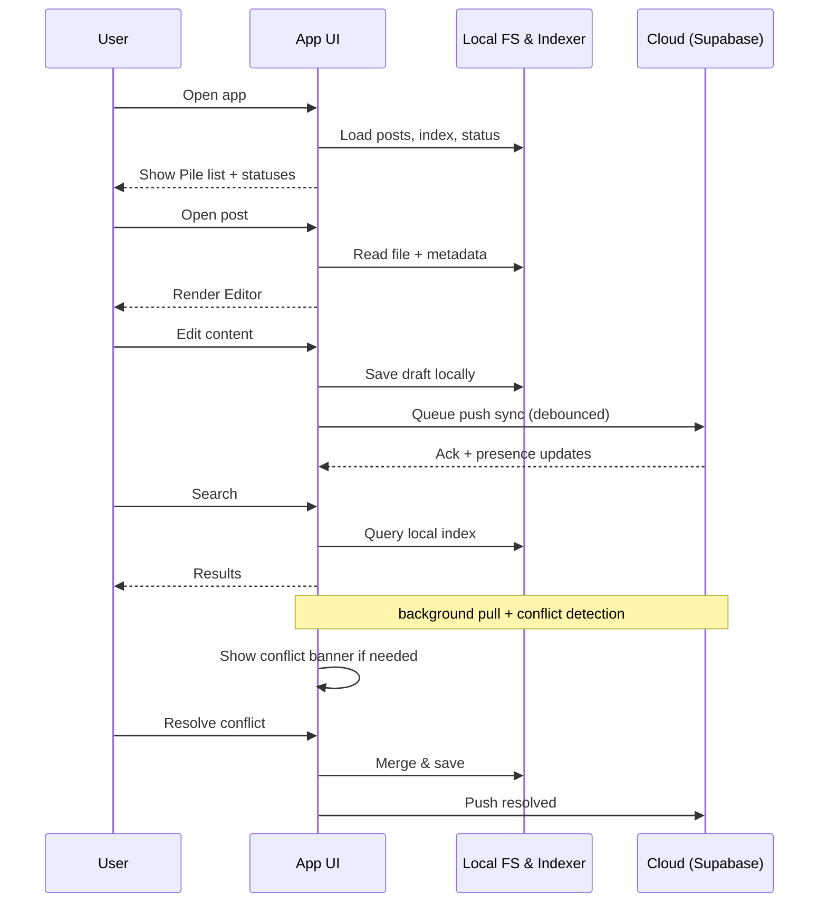

## Primary User Flow

```mermaid
sequenceDiagram
  participant U as User
  participant UI as App UI
  participant FS as Local FS & Indexer
  participant CL as Cloud (Supabase)

  U->>UI: Open app
  UI->>FS: Load posts, index, status
  UI-->>U: Show Pile list + statuses
  U->>UI: Open post
  UI->>FS: Read file + metadata
  UI-->>U: Render Editor
  U->>UI: Edit content
  UI->>FS: Save draft locally
  UI->>CL: Queue push sync (debounced)
  CL-->>UI: Ack + presence updates
  U->>UI: Search
  UI->>FS: Query local index
  UI-->>U: Results
  Note over UI,CL: background pull + conflict detection
  UI->>UI: Show conflict banner if needed
  U->>UI: Resolve conflict
  UI->>FS: Merge & save
  UI->>CL: Push resolved
```

Edge Cases:
- Offline edits queue until connectivity resumes.
- Conflict banner provides side-by-side diff and merge tools.

