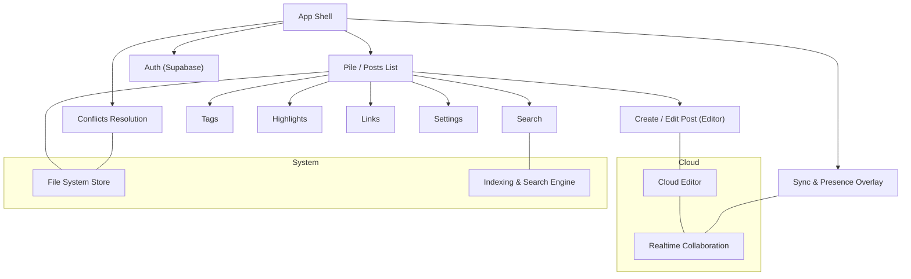

## Information Architecture (IA) Sitemap

```mermaid
flowchart TD
  A["App Shell"] --> B["Pile / Posts List"]
  B --> C["Create / Edit Post (Editor)"]
  B --> D["Search"]
  B --> E["Tags"]
  B --> F["Highlights"]
  B --> G["Links"]
  B --> H["Settings"]
  A --> I["Sync & Presence Overlay"]
  A --> J["Auth (Supabase)"]
  A --> K["Conflicts Resolution"]

  subgraph Cloud
    L["Cloud Editor"]
    M["Realtime Collaboration"]
  end

  C --- L
  L --- M

  subgraph System
    N["File System Store"]
    O["Indexing & Search Engine"]
  end

  B --- N
  D --- O
  K --- N
  I --- M
```

Notes:
- App shell manages navigation, theming, overlays.
- Core flows start from `Pile / Posts List` → `Editor`, `Search`, `Settings`.

