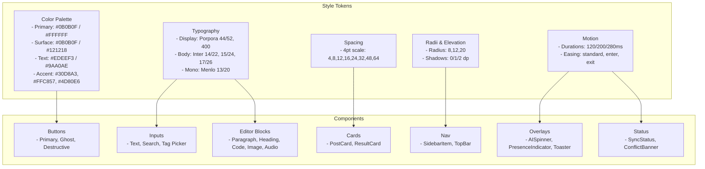

## Design Tokens

```mermaid
flowchart TD
  subgraph Style Tokens
    A["Color Palette\n- Primary: #0B0B0F / #FFFFFF\n- Surface: #0B0B0F / #121218\n- Text: #EDEEF3 / #9AA0AE\n- Accent: #30D8A3, #FFC857, #4D80E6"]
    B["Typography\n- Display: Porpora 44/52, 400\n- Body: Inter 14/22, 15/24, 17/26\n- Mono: Menlo 13/20"]
    C["Spacing\n- 4pt scale: 4,8,12,16,24,32,48,64"]
    D["Radii & Elevation\n- Radius: 8,12,20\n- Shadows: 0/1/2 dp"]
    E["Motion\n- Durations: 120/200/280ms\n- Easing: standard, enter, exit"]
  end

  subgraph Components
    F["Buttons\n- Primary, Ghost, Destructive"]
    G["Inputs\n- Text, Search, Tag Picker"]
    H["Cards\n- PostCard, ResultCard"]
    I["Nav\n- SidebarItem, TopBar"]
    J["Overlays\n- AISpinner, PresenceIndicator, Toaster"]
    K["Editor Blocks\n- Paragraph, Heading, Code, Image, Audio"]
    L["Status\n- SyncStatus, ConflictBanner"]
  end

  A --> F
  B --> G
  C --> H
  D --> I
  E --> J
  B --> K
  E --> L
```

Implementation will mirror CSS variables in `src/renderer/App.scss` and add SCSS maps for scale-driven spacing and typography.

