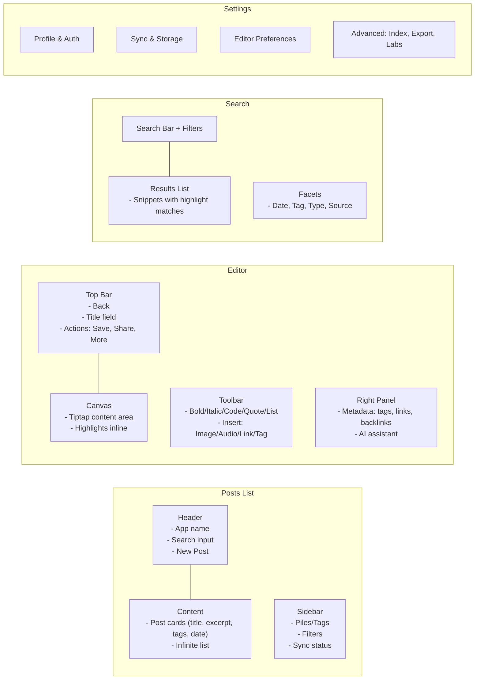

## Low‑Fi Wireframes (Structure)

```mermaid
flowchart LR
  subgraph Posts List
    A["Header\n- App name\n- Search input\n- New Post"]
    B["Sidebar\n- Piles/Tags\n- Filters\n- Sync status"]
    C["Content\n- Post cards (title, excerpt, tags, date)\n- Infinite list"]
  end
  
  subgraph Editor
    D["Top Bar\n- Back\n- Title field\n- Actions: Save, Share, More"]
    E["Toolbar\n- Bold/Italic/Code/Quote/List\n- Insert: Image/Audio/Link/Tag"]
    F["Canvas\n- Tiptap content area\n- Highlights inline"]
    G["Right Panel\n- Metadata: tags, links, backlinks\n- AI assistant"]
  end
  
  subgraph Search
    H["Search Bar + Filters"]
    I["Results List\n- Snippets with highlight matches"]
    J["Facets\n- Date, Tag, Type, Source"]
  end
  
  subgraph Settings
    K["Profile & Auth"]
    L["Sync & Storage"]
    M["Editor Preferences"]
    N["Advanced: Index, Export, Labs"]
  end

  A --- C
  D --- F
  H --- I
```

Notes:
- These are structural boxes only; visual styling comes from tokens.

